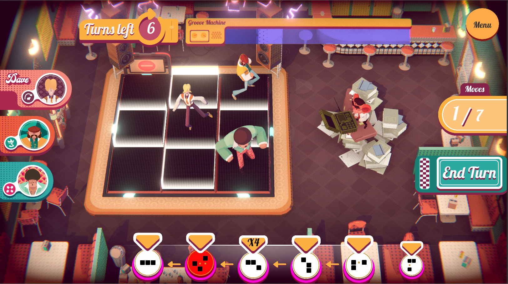

# Funk-Off

Funk-Off was a game that we developed during two intensive weeks at Supinfogame Rubika.

In this game, the player has to dance on some patterns and avoid the ennemy projectiles.

In game view

